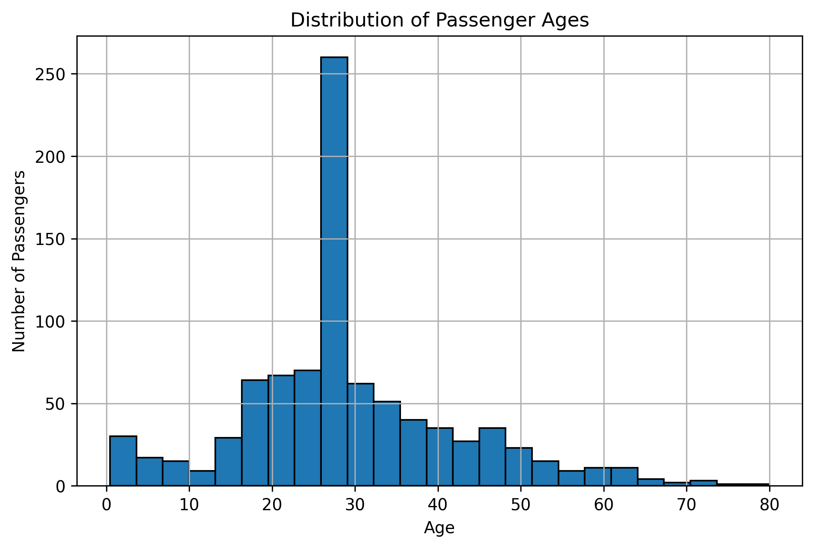
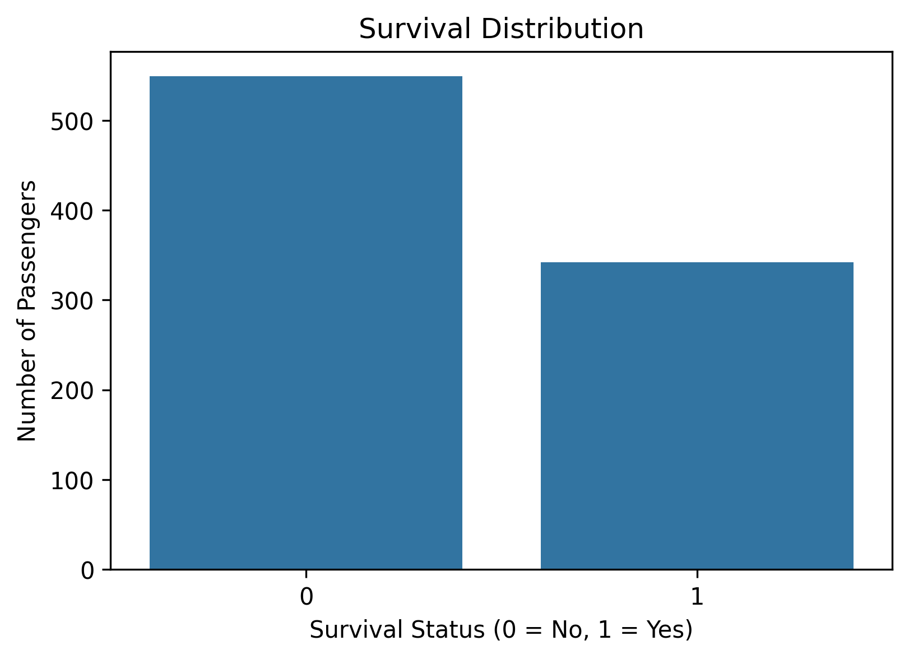
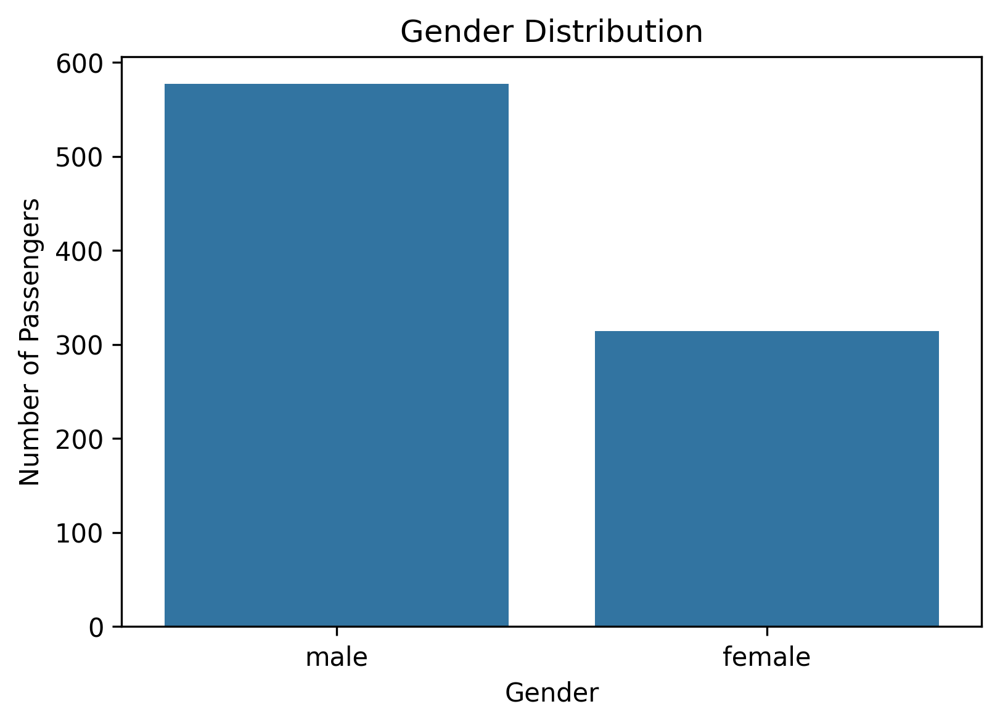
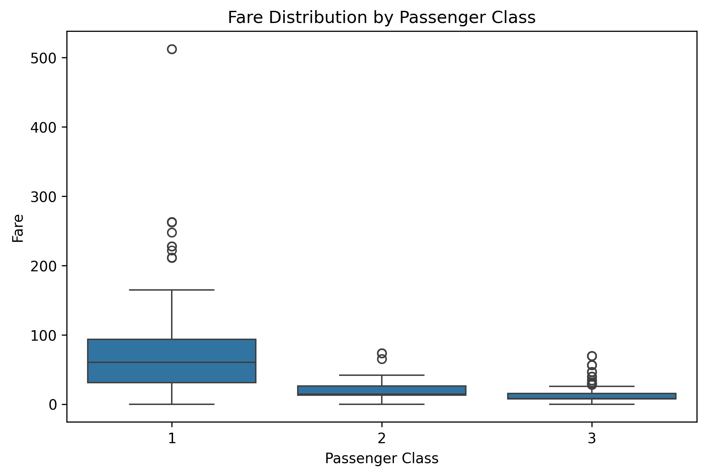

# Vortex Tech AI & ML Internship – Week 1

## Data Cleaning and Exploratory Data Analysis (EDA)

This repository contains my **Week 1 assignment** for the **Vortex Tech AI & ML Internship Program**. The objective of this project is to perform data cleaning and exploratory data analysis (EDA) on the Titanic dataset using Python and its data analysis libraries.

---

## 📌 Project Objective

The objectives of this project are to:

- Load and inspect a real-world dataset.
- Identify and handle missing values.
- Check for duplicate records.
- Verify data types.
- Generate summary statistics.
- Create meaningful visualizations.
- Document the complete data analysis process.

---

## 📂 Dataset

**Dataset:** Titanic Dataset

- **Source:** Kaggle
- **Format:** CSV
- **Rows:** 891
- **Columns:** 12

The dataset contains passenger information such as passenger class, age, gender, ticket fare, embarkation port, and survival status.

---

## 🛠 Technologies Used

- Python 3
- Jupyter Notebook
- Pandas
- NumPy
- Matplotlib
- Seaborn

---

## 📁 Project Structure

```text
VORTEXTECH-AIML-WEEK1/
│
├── data/
│   └── Titanic-Dataset.csv
│
├── images/
│   ├── age_distribution.png
│   ├── fare_distribution.png
│   ├── sex_distribution.png
│   └── survival_distribution.png
│
├── notebook/
│   └── Week1_DataCleaning_EDA.ipynb
│
├── README.md
├── requirements.txt
├── .gitignore
├── .gitattributes
└── venv/ (local virtual environment, not uploaded to GitHub)
```

---

## 📋 Tasks Completed

### ✅ 1. Imported Required Libraries

Imported the following libraries:

- Pandas
- NumPy
- Matplotlib
- Seaborn

---

### ✅ 2. Loaded the Dataset

- Loaded the Titanic dataset using Pandas.
- Displayed the first few rows.
- Inspected dataset information.
- Checked dataset dimensions and column names.

---

### ✅ 3. Data Cleaning

Performed data cleaning by:

- Checking for missing values
- Handling missing values where necessary
- Checking for duplicate records
- Removing duplicate rows (if present)
- Verifying data types

---

### ✅ 4. Exploratory Data Analysis (EDA)

Generated summary statistics using:

- `describe()`
- `value_counts()`

Created visualizations including:

- Age Distribution Histogram
- Survival Distribution Bar Chart
- Gender Distribution Bar Chart
- Fare Distribution by Passenger Class

---

## 📊 Sample Visualizations

### Age Distribution



---

### Survival Distribution



---

### Gender Distribution



---

### Fare Distribution by Passenger Class



---

## 📈 Key Observations

- The dataset was successfully loaded and explored.
- Missing values and duplicate records were identified and handled where necessary.
- Summary statistics provided insights into passenger demographics.
- Most passengers belonged to the younger and middle-age groups.
- The number of passengers who did not survive exceeded the number who survived.
- Male passengers outnumbered female passengers.
- First-class passengers generally paid higher fares than passengers in lower classes.

---

## ▶️ How to Run

### Clone the repository

```bash
git clone https://github.com/<your-github-username>/VORTEXTECH-AIML-WEEK1.git
```

### Navigate to the project folder

```bash
cd VORTEXTECH-AIML-WEEK1
```

### Create a virtual environment (optional)

```bash
python -m venv venv
```

Activate it.

**Windows**

```bash
venv\Scripts\activate
```

**Linux/macOS**

```bash
source venv/bin/activate
```

---

### Install the required packages

```bash
pip install -r requirements.txt
```

---

### Launch Jupyter Notebook

```bash
jupyter notebook
```

Open:

```
notebook/Week1_DataCleaning_EDA.ipynb
```

Run all cells to reproduce the analysis.

---

## 🎯 Learning Outcomes

Through this project, I learned how to:

- Import and inspect datasets using Pandas.
- Clean and preprocess real-world data.
- Handle missing values and duplicate records.
- Verify data types.
- Generate summary statistics.
- Create informative visualizations.
- Document a data analysis workflow using Jupyter Notebook.

---

## 👤 Author

**Pratik Sharma**

Bachelor of Computer Engineering (BCE)

Vortex Tech AI & ML Internship

2026
